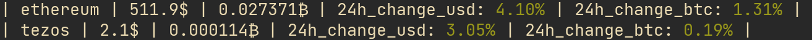

# Crypto info

This is simple CLI tool to fetch actual price data about given cryptocurrencies.

This tool uses free [Coin Gecko API](https://www.coingecko.com/en/api)
## Usage

1) To build an executable file open your terminal in repository folder and type: 

```
go build -o cryptoInfo ./cmd/main.go 
```
2) Then to run executable file type:
```
./cryptoInfo
```
3) You can use flags to specify additional behavior. 

    By default, this tool fetches data about bitcoin, but with help of -c flag you can specify any other cryptocurrency.
    Command below will fetch price of ethereum and output it in your terminal.
    ```
    ./cryptoInfo -c ethereum
    ```
    
    
    You can also specify list of cryptocurrencies to be fetched (Beware! Separate cryptocurrencies by coma with no space afterwards).
    ```
    ./cryptoInfo -c ethereum,tezos
    ```
    Will fetch actual price of both ethereum and tezos and output it in your terminal.
    
## Flags

This tool is heavily dependent on using flags (as most of CLI tools).

**There set of flags**:
- -c list cryptocurrencies by name separated by comma.
- -h saves 30 day price history in .csv file format into /output directory.
- -t sets request timeout time in seconds.